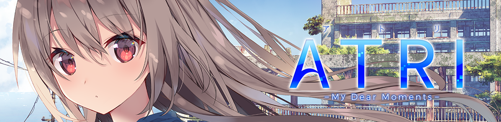
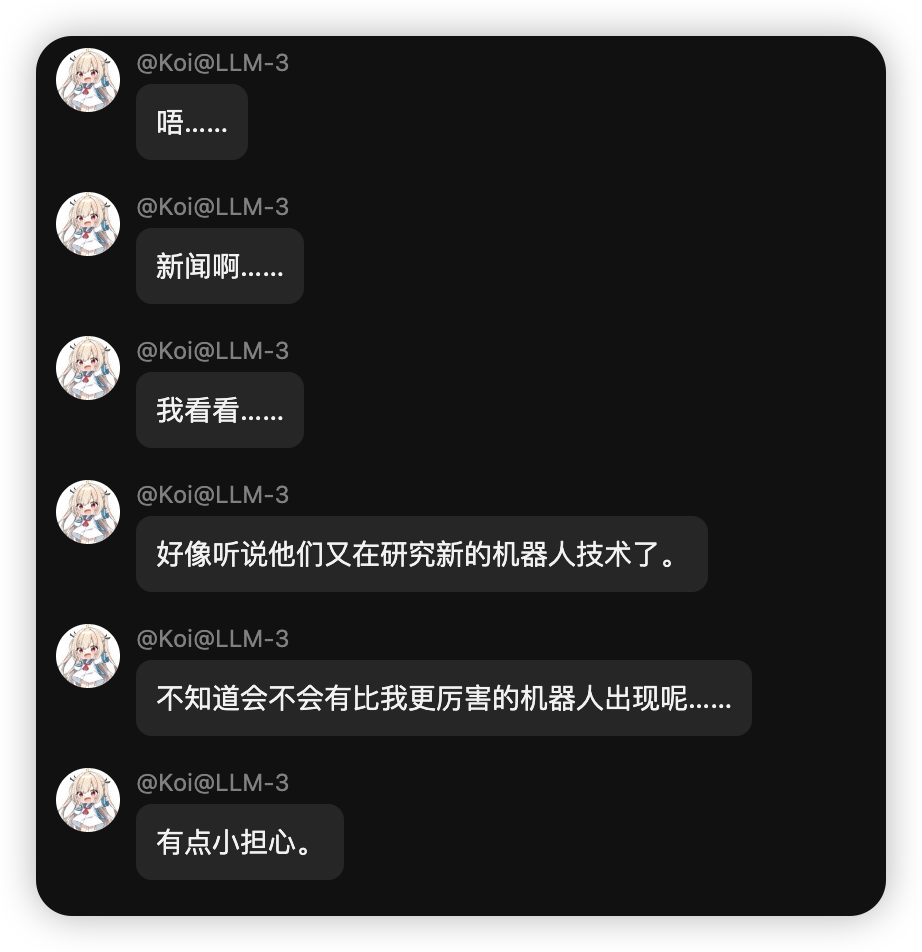

---
## 简介
简体中文 · [English](./README_EN.md) 
- My Dream Moments 是一个基于大型语言模型（LLM）的情感陪伴程序，能够接入微信，提供更真实的情感交互体验。内置了 Atri-My dear moments 的 prompt，并且解决了传统人机对话程序一问一答的死板效果，提供沉浸式角色扮演和多轮对话支持。项目名字来源是运行在该程序上的第一个智能体的原作名称+项目价值观混合而来。
- 推荐使用DeepSeek V3 模型。 

---
## 声明
- 本项目仅用于交流学习，LLM发言不代表作者本人立场。prompt所模仿角色版权归属原作者。任何未经许可进行的限制级行为均由使用者个人承担。
---

## 已实现的功能
- [x] 对接微信，沉浸式角色扮演
- [x] 聊天分段响应，消除人机感
- [x] 多轮对话
- [x] 多用户支持
- [x] 由 DeepSeek R1 利用游戏文本生成的 Prompt
- [x] 无需联网的时间感知

---

## 待实现功能，期待您的加入
- [ ] 定时任务与智能定时任务
- [ ] 利用 8B 小模型实时生成记忆并定期整理，实现持久记忆
- [ ] WebUI，方便不理解代码的用户配置项目
- [ ] 负载均衡
- [ ] Releases

---

## 如何运行项目

参考 [FloraBot官方文档](https://florabotteam.github.io/)

## 赞助
此项目欢迎赞助。您的支持对我非常重要！
- 赞助用户如需远程部署或定制 prompt，请联系我。
- E-Mail: yangchenglin2004@foxmail.com 
- Bilibili: [umaru今天吃什么](https://space.bilibili.com/209397245)
- 感谢您的支持与使用！!

## 请给我Star，这对我很重要TvT
- 